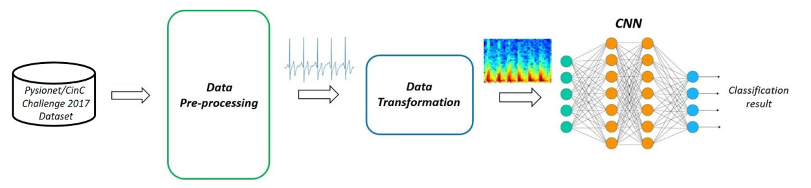

# ECG-classification

The present project focuses on the implementation of a Convolutional Neural Network(CNN) for the Electrocardiogram(ECG) classification. In particular, the main objective of the work is the atrial fibrillation recognition task, as it was proposed in the 2017 PhysioNet/CinC Challenge.
At this end, we propose an 8-layer 2D CNN for the classification of the spectrograms that are associated to the original ECG recordings provided in the dataset of the Challenge. More precisely, the workflow that we have followed is organized in three fundamental steps:

